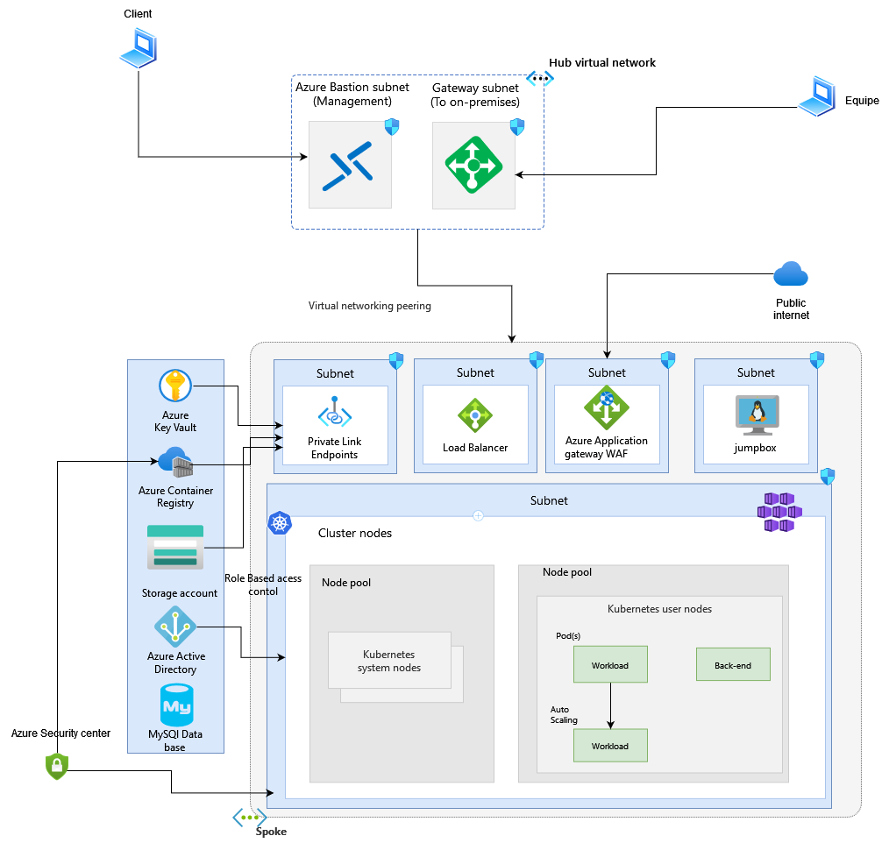

# IaC-OpenTofu

## Create a private Azure Kubernetes Service cluster using opentofu
This example illustrates the process of setting up a private AKS cluster using the following components:

  - [OpenTofu](https://opentofu.org/) as infrastructure as code (IaC) tool to build, change, and version the infrastructure on Azure in a safe, repeatable, and efficient way.

In a private AKS cluster, the API server endpoint remains inaccessible via a public IP address. Thus, managing the API server necessitates using a virtual machine with access to the AKS cluster's Azure Virtual Network (VNet). This example achieves this by deploying a jumpbox virtual machine within the hub virtual network, which is peered with the virtual network housing the private AKS cluster.

Various options exist for establishing network connectivity to the private cluster:

-Deploying a virtual machine within the same Azure Virtual Network (VNet) as the AKS cluster.
-Utilizing a virtual machine in a separate network and configuring Virtual Network peering. Further details on this option are provided below.
-Employing an Express Route or VPN connection.

Deploying a virtual machine in either the same virtual network as the AKS cluster or in a peered virtual network represents the simplest approach. However, utilizing Express Route or VPNs introduces additional costs and networking complexities. Virtual network peering necessitates careful planning of network CIDR ranges to prevent overlapping ranges.

Additionally, this example configures a private endpoint to access all managed services deployed by the Terraform modules via a private IP address, including:

    Azure Container Registry
    Azure Storage Account
    Azure Key Vault

## Architecture ##

The following picture shows the high-level architecture created by the Terraform modules included in this sample:

## Virtual Networks ##

Two virtual networks are created to isolate and secure resources:

    Hub Virtual Network:
        This virtual network acts as a central hub for internal connectivity.
        It hosts a gateway service allowing the team to securely access the private AKS cluster.
        A bastion is configured to enable clients to inspect the cluster configuration securely.

    AKS Virtual Network:
        This virtual network hosts the private AKS cluster.
        Azure Private Endpoints are utilized for Azure Container Registry, Azure Key Vault, and Azure Storage Account, ensuring secure connectivity.
        A subnet is dedicated to deploying a "jumpbox" virtual machine to facilitate access to the cluster configuration.
        Another subnet is reserved for Azure Application Gateway WAF, enabling the management of inbound traffic rules from the public internet.
       

